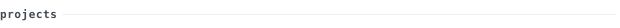

[devenwagh.dev](https://github.com/DEVENWAGH) &nbsp;·&nbsp;
[linkedin](https://www.linkedin.com/in/devenwagh/) &nbsp;·&nbsp;
[twitter](https://twitter.com/devenwagh) &nbsp;·&nbsp;
[email](mailto:devenwagh@example.com)

> Full-Stack Developer based in India, building products that go from 
> idea to production. I care more about shipping than accumulating tickets.

I work across the entire stack — React frontends, Node/Python backends, 
databases, infra. Currently focused on developer tooling and web experiences 
that feel fast and intentional. 28 public repositories and counting.

<samp>typescript &nbsp; javascript &nbsp; react &nbsp; next.js &nbsp; node &nbsp; python &nbsp; tailwind &nbsp; postgres &nbsp; docker &nbsp; git &nbsp; linux</samp>

Browse pinned repositories on the profile or explore the full list at 
[github.com/DEVENWAGH?tab=repositories](https://github.com/DEVENWAGH?tab=repositories).

<!-- ──────────────────────────────────────────────────────────── -->
<!-- Add your top 2-3 projects below in this format:            -->
<!--                                                            -->
<!-- **[repo-name](https://github.com/DEVENWAGH/repo-name)**    -->
<!-- &nbsp;·&nbsp; <samp>typescript, react</samp>            -->
<!-- One-line description.                                    -->
<!-- Second line if needed.                                      -->
<!-- ──────────────────────────────────────────────────────────── -->

---

Every graphic on this page is generated by this repository's own 
<a href=".github/workflows/refresh.yml">scheduled workflow</a> — no third-party services.

